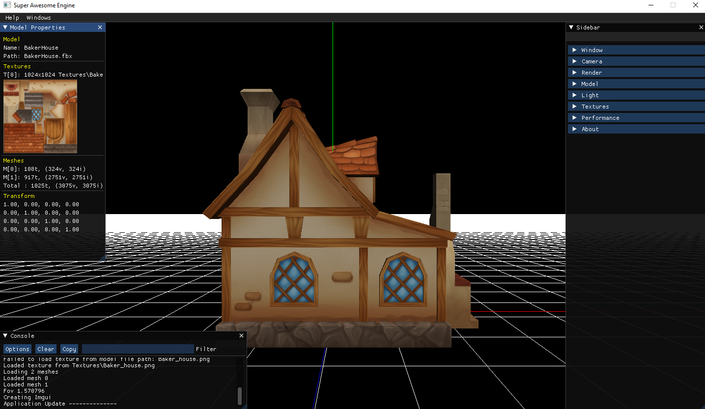

# UPC-Engine

This is an engine done for the Videogame Development Master at UPC School.
You can check the project here: 
https://github.com/Bernatmago/UPC-Engine

## Team (1st Delivery)
- [**Bernat Martinez Gomez** (Bernatmago)](https://github.com/Bernatmago)

## Short Guide

To see a model just drop it into the screen, you can also unload the current model and the engine will still work while empty.

### Menus

There are 3 main menus:
- Console
- Sidebar
- Model properties

They can be closed and reopened from the upper menu bar. Each of them has a series of options related to the modules they are contained in.

### Camera Controls
- **Navigate & rotate:** right click movement + wasd (arrows can be used to rotate)
- **Orbit:** alt + left click movement
- **Focus (Look at object):** F key
- **Zoom (Change fov):** mouse wheel

## Extra features
- Basic phong (no specular): It computes light by (difuse + specular) * light_color * texture_color. It also has a simple menu to play with it.
- Bounding box drawing and some render options.
- Small camera additions, auto extend far plane based on bounding box and lock camera on object (different from orbit).
- Default gui alignment based on window size.

## Notes
Some models are big which can make camera arrow movement look slow, it can also make positional light work poorly (you can switch to directional).

Models are from Clàudia Escuder.

